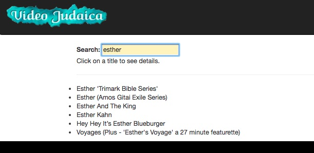
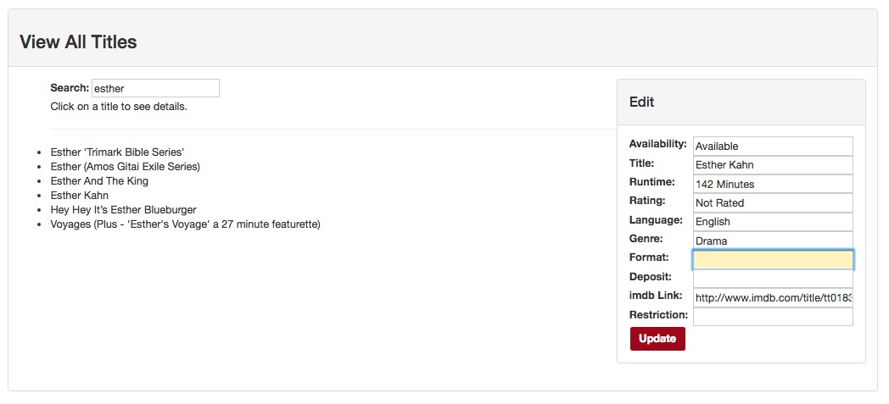

# Video Judaica website

#### By Esti Shay, Ryan Nunez, Maria Thomas, Paul Guevarra, and Kheifer Fuller

## Description
Website for the nonprofit Sylvia Suckerman Jewish Media Collection, aka Video Judaica. Searchable title list with ability to request rentals and apply for membership. Admin dashboard for the manager to add, update, and delete items from the database.

## Specifications

### User Stories
1. As a potential member, I want to apply for membership online.
2. As a member, I want to submit requests for rentals online.
3. As a member, I want to pay my membership and rental fees through the website.
4. As the manager, I want to see membership requests and mark them processed.
5. As the manager, I want to see rental requests, and be able to mark them checked out and returned.
6. As the manager, I want to add new items to my database of items.
7. As the manager, I want to update my item records.
8. As the manager, I want to delete item records when items wear out or are returned in an unusable state.
9. As the manager, I want a storefront to sell my movie memorabilia collection.
10. As the web admin, I want access to the manager's dashboard.

### Future Features
1. Build user account system, allowing...
  * Prospective users to apply for membership through the website.
  * Members will be able to request rentals through their account.
2. Membership applications and rental requests will be managed through the admin dashboard.
3. Transition to relational database.
4. Implement online payment using Square.
5. Build a store to sell manager's movie memorabilia collection.

## Design

### Website

(Input fields turn yellow when active.)

### Admin Dashboard

(Buttons change to red when cursor hovers over it.)

#### Memorabilia Shop (Under development)

## Setup/Installation Requirements
* Clone the repo
* Run npm install. The Angular dependencies are not the most recent, due to a bug with the latest AngularFire update.
* Run bower install and bower install bootstrap --save
* Create a Firebase account. In the app folder, create api-keys.ts.

### Known Bugs
The keyword search occasionally returns titles that have the letters entered but not in the correct order, i.e. a search for "Kahn" with also return items with "Chanukah" in the title.

### Technologies Used
This project was generated with [Angular CLI](https://github.com/angular/angular-cli). Data hosted in Firebase. Images and logo provided by client.

#### Development server

Run `ng serve` for a dev server. Navigate to `http://localhost:4200/`. The app will automatically reload if you change any of the source files.

#### Code scaffolding

Run `ng generate component component-name` to generate a new component. You can also use `ng generate directive|pipe|service|class|guard|interface|enum|module`.

#### Build

Run `ng build` to build the project. The build artifacts will be stored in the `dist/` directory. Use the `-prod` flag for a production build.

#### Further Angular help

To get more help on the Angular CLI use `ng help` or go check out the [Angular CLI README](https://github.com/angular/angular-cli/blob/master/README.md).

### License

Copyright &copy; 2017 Esti Shay
